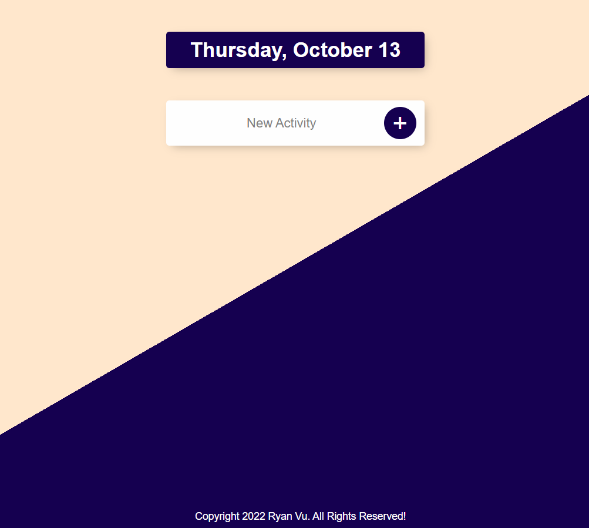

# todolistv2

Live version: https://ryan-todolist.herokuapp.com/

This app is built using HTML, CSS, JavaScript, EJS (Embedded JavaScript Templating) , NodeJS, ExpressJS, MongoDB, Mongoose and is deployed using Heroku.

This app uses Dynamic Routing Parameters, which allows user to create multiple lists by simply adding any parameter after the initial URL.

For example: https://ryan-todolist.herokuapp.com/work --> Work List  
or: https://ryan-todolist.herokuapp.com/wishlist --> Wishlist List

This app will be updated to include additional function.

